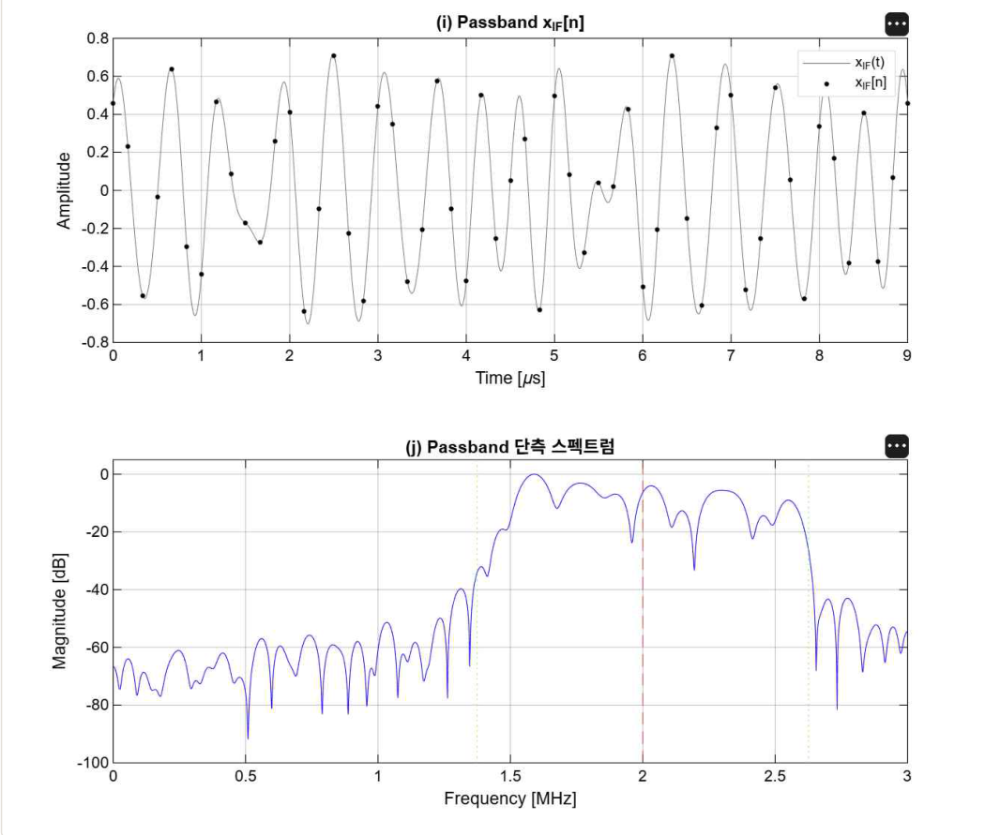
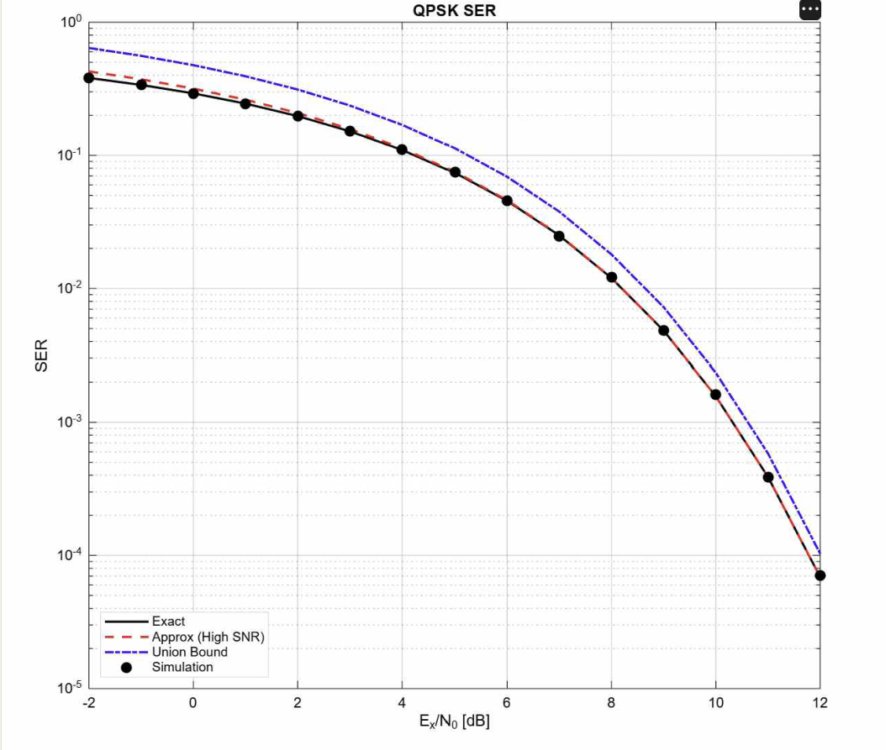
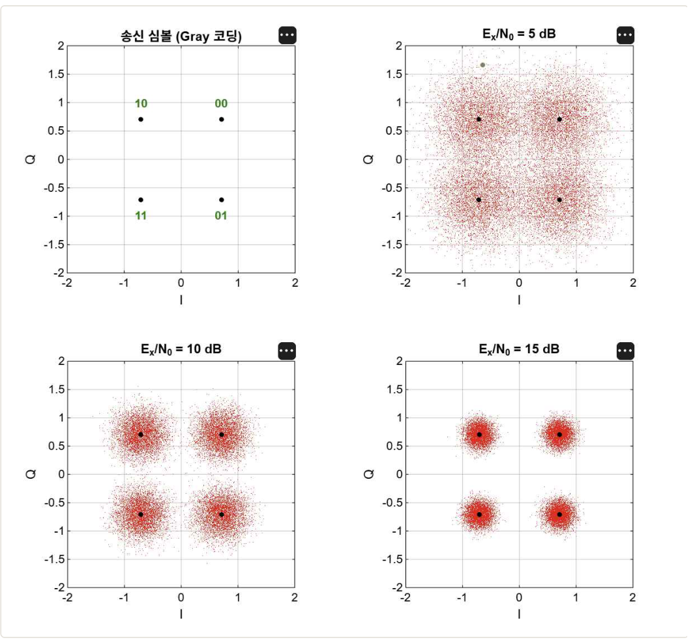
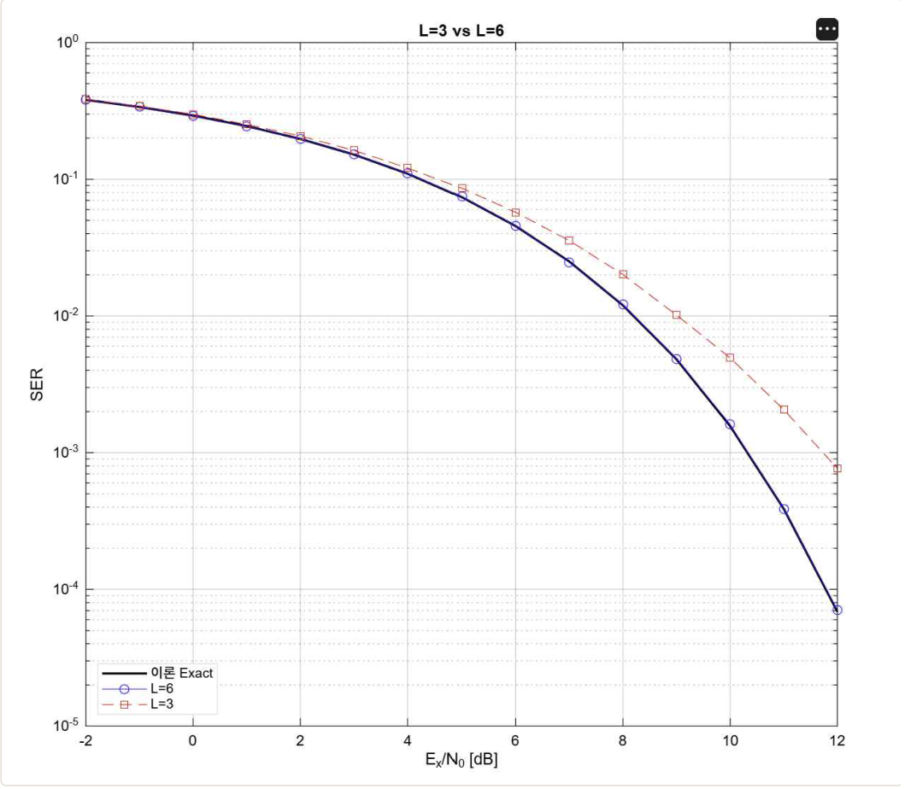

# digital_communication_project

## Passband AWGN 환경에서의 QPSK 송수신기 구현 및 SER 성능 분석

MATLAB으로 QPSK 디지털 송수신기를 IF passband 기준으로 구현하고, 시뮬레이션으로 측정한 심볼 오류율(SER)을 이론값과 비교한 프로젝트입니다. 툴박스 함수 없이 모든 블록을 수식 그대로 구현해, 각 단계가 어떤 연산으로 동작하는지 코드 수준에서 확인하는 것을 목표로 했습니다.

---

## 프로젝트 목표

- 송신기, 채널, 수신기를 독립된 함수로 나눠 구현하고 단위 검증이 가능하도록 구성
- `rcosdesign`, `qfunc` 같은 툴박스 함수를 쓰지 않고 RRC 필터와 Q 함수를 직접 구현
- 시뮬레이션 SER이 이론 SER과 일치하는지 −2 ~ 12 dB 전 구간에서 정량 확인
- 샘플링 조건(업샘플 인수)이 성능에 미치는 영향을 원인까지 분석

**시스템 파라미터**

| 항목 | 값 |
|---|---|
| 변조 방식 | QPSK (Gray 매핑) |
| 심볼률 / IF 주파수 | 1 MHz / 2 MHz |
| 업샘플 인수 L / 샘플링 주파수 | 6 / 6 MHz |
| RRC roll-off / span | 0.25 / 10 심볼 (61 탭) |
| SNR 범위 | Es/N0 −2 ~ 12 dB, 1 dB 간격 |

## 과정

### 신호 처리 흐름

```
[송신기]  랜덤 비트 → Gray 심볼 매핑 → 업샘플(×L) → RRC 펄스 성형 → 디지털 업컨버전
[채널]    실수 passband AWGN
[수신기]  디지털 다운컨버전 → RRC 정합 필터 → 심볼 시점 다운샘플 → ML 검출 → 역매핑
```

### 구현에서 신경 쓴 점

- **RRC 필터 직접 구현**: 연속시간 임펄스 응답 수식을 샘플링하고, 분모가 0이 되는 특이점(τ = 0, τ = ±1/4α)은 극한값으로 따로 처리. 에너지 정규화(Σg² = 1)와 대칭성을 수치로 확인
- **√2 전력 정규화**: 업컨버전과 다운컨버전 양쪽에 √2를 두어 passband 전력과 기저대역 전력을 같게 유지. 한쪽에만 적용하면 SNR 계산이 틀어짐
- **그룹지연 보정**: 송신 RRC와 수신 정합 필터를 거치며 생기는 60샘플 지연을 계산해 심볼 시점을 정확히 맞춤. 무잡음 루프백에서 비트 오류 0개 확인
- **적응적 몬테카를로**: 고 SNR에서 오류 표본이 부족해 결과가 흔들리는 문제를 발견하고, 각 SNR에서 오류 심볼이 500개 누적될 때까지 블록 단위로 전송을 반복하도록 수정

### 검증 1. 송신 단계별 파형과 스펙트럼



업컨버전 후 passband 신호와 단측 스펙트럼입니다. 신호 에너지의 99.99%가 설계 대역 [1.375, 2.625] MHz 안에 위치해 대역 제한이 의도대로 이루어졌음을 확인했습니다.

### 검증 2. SER 시뮬레이션 vs 이론



정확값, High SNR 근사, Union Bound 세 이론 곡선과 시뮬레이션 결과를 비교했습니다. 첫 시도에서는 비트 수를 고정한 탓에 11 ~ 12 dB 구간이 이론에서 벗어났고(시뮬/이론 비 0.88, 0.79), 원인이 알고리즘이 아니라 오류 표본 부족에 있음을 확인한 뒤 적응적 몬테카를로로 바꿔 해결했습니다.

### 검증 3. 수신 심볼 성상도



Es/N0 = 5, 10, 15 dB에서 수신 성상도를 출력하고 클러스터 분산을 측정했습니다. I축과 Q축 분산이 이론값 σ² = 1/(2γ)와 소수점 셋째 자리까지 일치했습니다.

### 검증 4. 업샘플 인수 L = 3 vs L = 6



L = 6은 이론 곡선에 밀착하지만 L = 3은 고 SNR로 갈수록 에러 플로어 형태로 열화됩니다. 원인은 세 가지가 겹친 것입니다. fs/2 = 1.5 MHz가 신호 상단 2.625 MHz보다 낮아 나이퀴스트 조건이 깨지고, 다운컨버전에서 생긴 2fIF 성분이 접혀 정합 필터 통과대역 안으로 들어오며, 그 결과 잡음과 무관한 결정론적 자기간섭이 생겨 SNR을 높여도 사라지지 않습니다.

## 결과

| 검증 항목 | 결과 |
|---|---|
| 송신 대역 내 에너지 | 99.99% |
| 무잡음 루프백 비트 오류 | 0개 |
| SER 시뮬/이론 비 (−2 ~ 12 dB) | 0.986 ~ 1.016 |
| 수신 성상도 분산 (5 / 10 / 15 dB) | 0.1581 / 0.0501 / 0.0159 (이론 0.1581 / 0.0500 / 0.0158) |
| L = 3의 12 dB SER 열화 | L = 6 대비 약 13배 |

---

## 실행 방법

MATLAB에서 `src/` 폴더를 작업 경로로 두고 아래 스크립트를 실행하면 됩니다. 파라미터는 `params.m` 한 곳에서 관리합니다.

```
test_rrc.m               RRC 필터 에너지, 대칭성, ISI-free 확인
test_tx.m / test_rx.m    송신 체인 확인, 무잡음 루프백
verify1_waveforms.m      검증 1: 단계별 파형과 스펙트럼
run_ser.m                검증 2: SER vs 이론
verify3_constellation.m  검증 3: 수신 성상도
verify4_L_compare.m      검증 4: L = 3 vs L = 6
```

### 프로젝트 구조

```
digital_communication_project/
├── src/        # 송수신 모듈과 검증 스크립트 (MATLAB)
├── figures/    # 검증 결과 그림
└── docs/       # 프로젝트 보고서
```

## 보고서

- [프로젝트 결과 보고서 (PDF)](docs/디지털통신_프로젝트보고서.pdf)
